# Ionic 2 Circular Tabs

This is demo of Circular Tabs Ionic 2 Plugin.

##Getting Started

*Clone this repository.
*Run npm install from the project root.
*Install the ionic CLI (npm install -g ionic)
*Run ionic serve in a terminal from the project root.
*Profit

**Note:** Is your build slow? Update npm to 3.x: npm install -g npm.

##Ionic Info

*Cordova CLI: 6.3.1
*Gulp version: CLI version 3.9.1
*Ionic CLI Version: 2.1.1
*Ionic App Lib Version: 2.1.1
*Node Version: v4.6.0

##Preview

 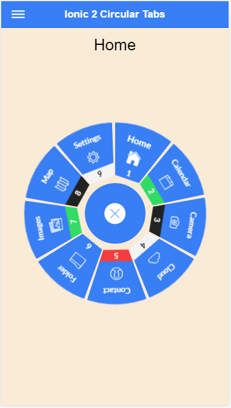
 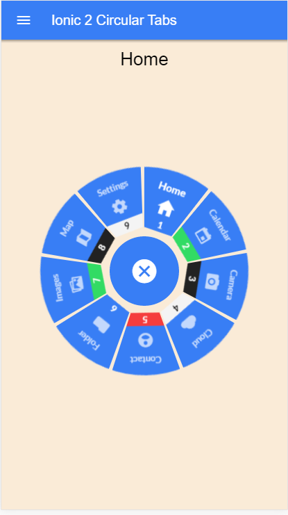
 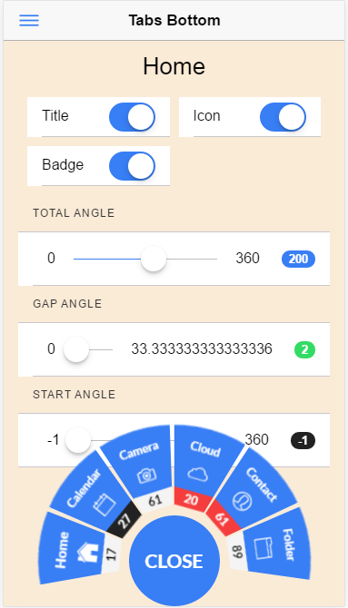
 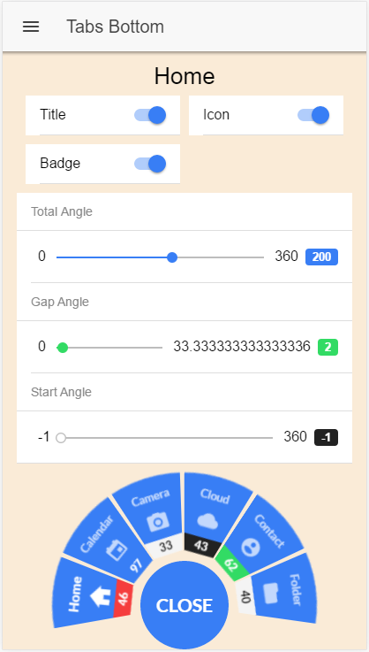
 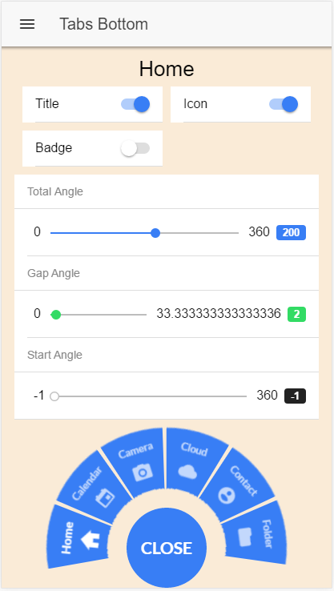
 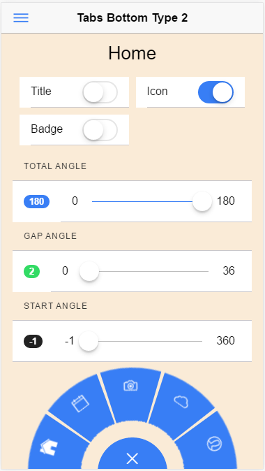
 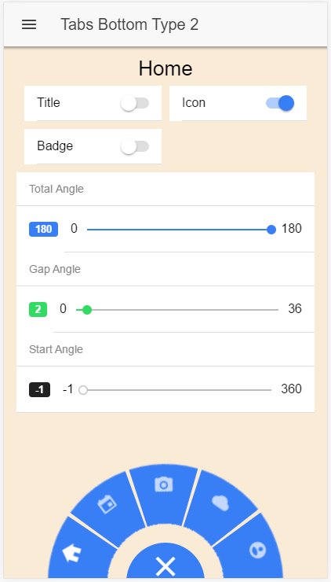
 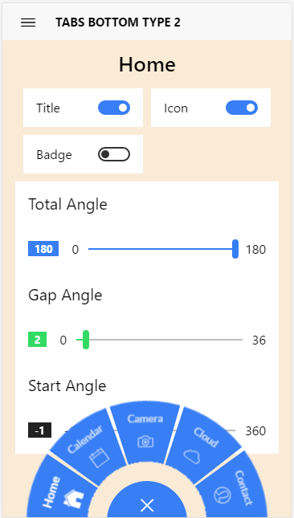
 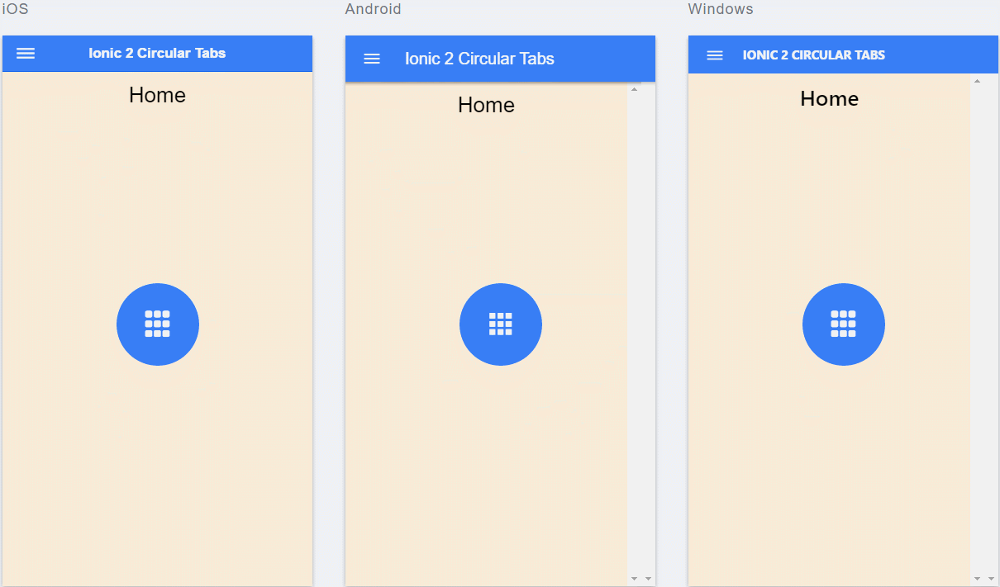
 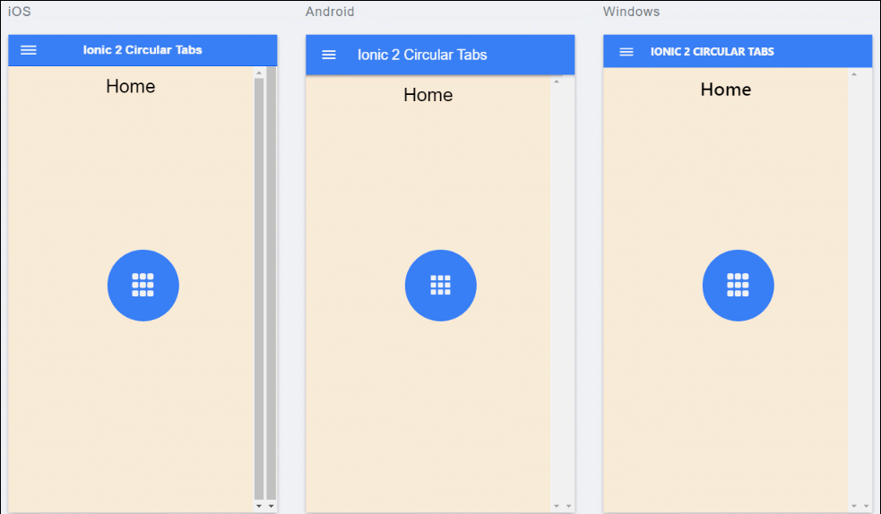
 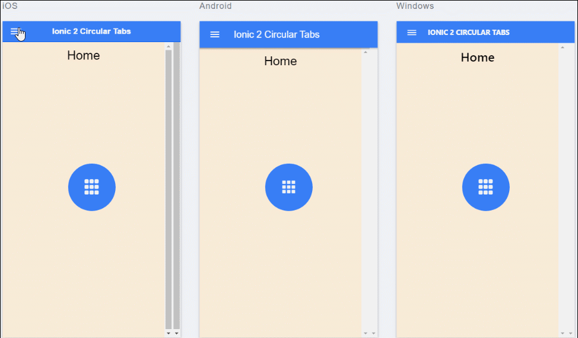
